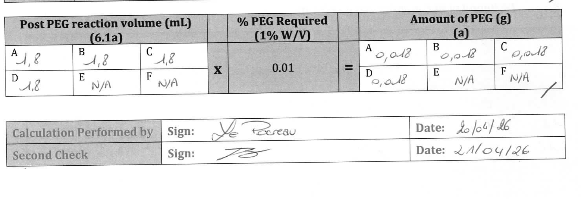
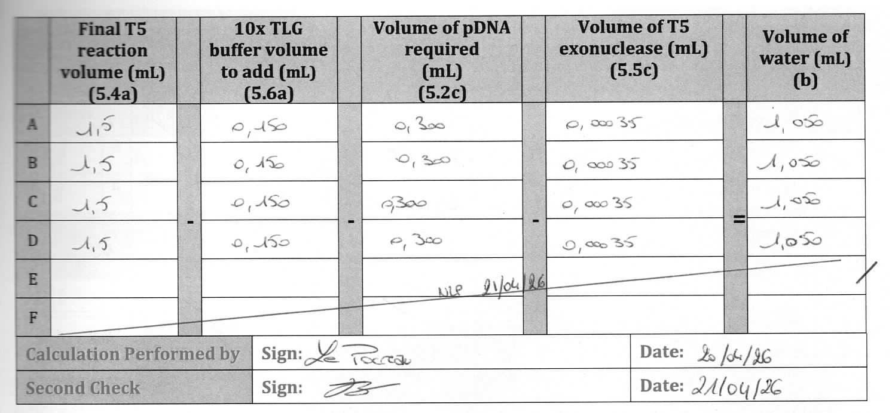

# Additions
Vérification d'opérations mathématiques dans un cahier de labo

## Généralité
Application web destinée à être utilisée sur un téléphone dans le navigateur.

## Fonctionnement
A partir de l'application, l'utilisateur utilise la caméra pour prendre en photo une section contenant des opérations écrite manuellement. Il dispose d'un moyen d'indiquer la partie de la photo à exploiter (cadre ou rognage). L'application reconnait le type de section, les opérations à effectuer, effecture le calcul et indique : 
-  les résultats des opérations
- si le résultat est identique ou non au résultat obtenu par celui qui a posé l'opération manuellement, opération par opérations

On distingue 3 types de section, voir les 3 exemples

## exemples
cas 1 :   : chaque valeur A, B, .. à droite est calculée en appliquant. l'opération au mileu aux valeurs A, B, .. à gauche
par exemple pour B : 1.8 * 0.01 = 0.018

cas 2 :  : chaque ligne est une opération, l'opérateur à appliquer est indiqué entre. les colonnes.
par exemple pour B : 1.5 - 0.150 - 0.300 - 0.0035 = 1.050 
NOTE: le résultat exact est 1.0465, l'arrondi 1.050 est valide, on autorise les arrondis à l'unité la plus proche pour tous les cas

cas 3 : 
 et [yield](./yeld_operation.png)

## contrainte impérative
Doit fonctionner avec le navigateur safari sous iOS

## objectifs (si possible)
l'application tourne entièrement dans le navigateur (pas de backend)
l'application est hébergée en github pages.

## Planification
Analyse les spécifications ci-dessus. Identifie les technologies à utiliser (librairie, language, structure) pour y répondre.
Analyse les possibilités de répondre aux différents objectifs, explique pour chacun ce qui est possible ou non. 
